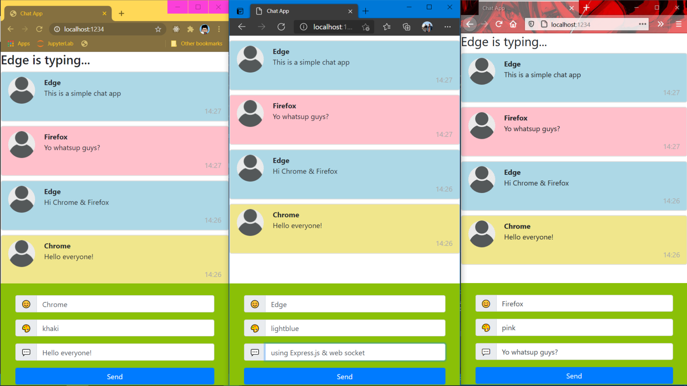

# Simple chat app (Express.js & Socket.io)

1. Clone this repo then install Express.js & socket.io package.

    ```bash
    $ git clone https://github.com/LintangWisesa/Express_WebSocket_SocketIO.git

    $ cd Express_WebSocket_SocketIO

    $ npm i express socket.io
    ```

2. Run this project, I prefer use Nodemon.

    ```bash
    $ npm i -g nodemon

    $ nodemon app
    ```

3. It will run on your local server port 1234. Open it on your browser & have fun!

    

#### Lintang Wisesa :love_letter: _lintangwisesa@ymail.com_

[Facebook](https://www.facebook.com/lintangbagus) | 
[Twitter](https://twitter.com/Lintang_Wisesa) |
[Google+](https://plus.google.com/u/0/+LintangWisesa1) |
[Youtube](https://www.youtube.com/user/lintangbagus) | 
:octocat: [GitHub](https://github.com/LintangWisesa) |
[Hackster](https://www.hackster.io/lintangwisesa)